# Java虚拟机

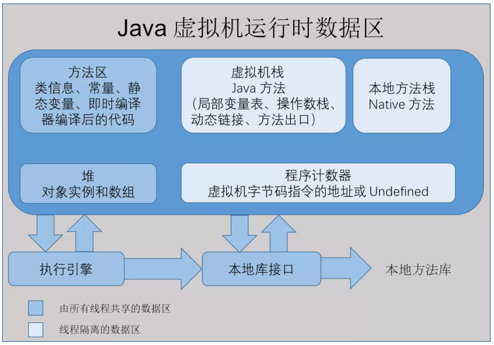

## 一、虚拟机数据区说明
1、程序计数器
 - 定义：可以看作是当前线程所执行的字节码的行号指示器，为线程隔离的数据区。
 - java多线程切换时，每个线程独立的程序计数器，各条线程之间的计数器互不影响，独立存储，保证了线程切换后能恢复到正确的位置。
 
2、Java虚拟机栈
 - 定义：每个方法执行的时候，Java虚拟机都会同步的创建一个栈帧用于储存局部变量表、操作数栈、动态链接、方法出口等信息。每个方法被调用直至执行完毕的过程，就对应着一个栈帧在虚拟机栈中从入栈到出栈的过程。
 - 局部变量表存放了编译期可知的各种Java虚拟机基本数据类型（boolean、byte、char、short、int、float、long、double）、对象引用（reference类型）和returnAddress类型（指向一条字节码指令的地址）、
 - 在栈深度溢出或栈扩展失败时分别抛出StackOverFlowError和OutOfMemoryError的异常。 
 
3、本地方法栈
 - 定义：为虚拟机使用到的本地（Native）方法服务。
 - HotSpot直接把本方法栈和虚拟机栈合二为一。
 - 在栈深度溢出或栈扩展失败时分别抛出StackOverFlowError和OutOfMemoryError的异常。
 
4、Java堆
 - 定义:是虚拟机所管理的内存中最大的一块。Java堆是被所有线程共享的一块内存区域，在虚拟机启动时创建。
 - 参数-Xmx和-Xms 最大堆内存和最小堆内存
 
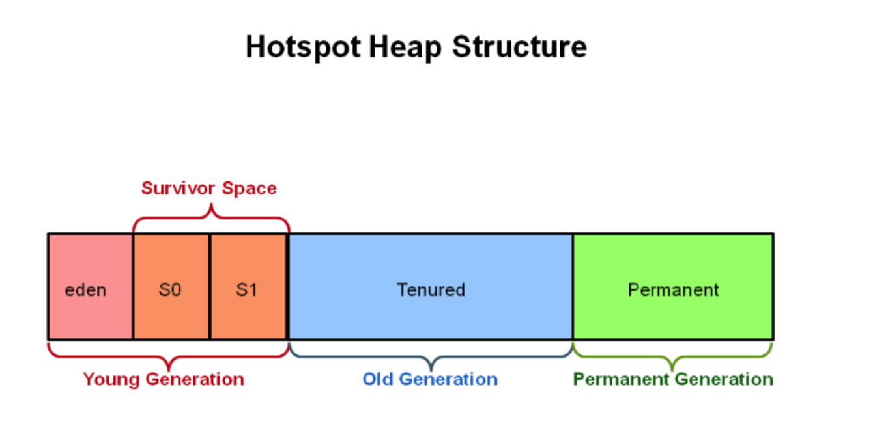

5、方法区
 - 定义：是被各个线程共享的内存区域，它用于存储已被虚拟机加载的类型信息、常量、静态变量、即时编译器编译后的代码缓存等数据。
 - JDK8以前使用永久代来实现方法区（-XX:MaxPermSize 设置上限）
 TODO
 
6、运行时常量池
 - 定义：运行时常量池是方法区的一部分。Class文件除类字段、方法、接口等描述信息外，还有一项信息是常量池表，用于存放编译期生成的各种字面量和符号引用，在类加载后存放到方法区的运行时常量池中。
 - 运行时常量池具备动态性，运行期间可以将新的常量放入池中，当无法申请到空间抛出OutOfMemoryError异常。

## 二、垃圾收集器与内存分配策略
- 程序计数器、虚拟机栈、本地方法栈3个区域随线程而生而灭，因此这几个区域的内存分配和回收都具备确定性，不需要过多考虑回收问题。

1.判断对象是否已死的方法
 - 引用计数法：
   - 定义：在对象中添加一个引用计数器，有一个地方引用时，计数器值加一，引用失效时减一。
   - 优点：原理简单，判定效率也很高。
   - 缺点：难以解决对象之间互相循环引用的问题。
 - 可达性分析算法：
   - 定义：通过一系列成为“GC Roots”的根对象作为起始节点集，从这些节点开始，根据引用关系向下搜索，搜索过程所走过的路径称为“引用链”。弱某对象到GC Roots间没有任何引用链相连，证明此对象是不可能再被使用的。
   - GC Roots的对象分为以下几种：
     1. 虚拟机栈中的引用对象，入线程调用方法堆栈的参数、局部变量、临时变量等。 
     2. 在方法区中类静态属性引用的对象。如Java类的引用类型静态变量。
     3. 在方法区中常量引用对象，如字符串常量池的引用。
     4. 在本地方法栈中的JNI（Native方法）引用的对象。
     5. Java虚拟机内部的引用，如基本类型对应的Class对象，一些常驻异常对象（NullPointException)等，还有系统类加载器。
     6. 所有被同步锁(synchronize关键字)持有的对象。
     7. 反映Java虚拟机内部情况的JMXBean、JVMTI中注册的回调、本地缓存代码等。
     
2.对象引用
- 强引用(Strongly Reference): Object obj = new Object()。关系存在虚拟机就不会回收。
- 软引用(Soft Reference)：用来描述一些还有用但非必须的对象。在系统要发生内存溢出会收集软引用对象，若回收完成仍内存不足，才抛出内存遗传。
- 弱引用(Weak Reference)：弱引用关联的对象只能生存到下一次垃圾收集发生为止。
- 虚引用(Phantom Reference)：最弱的引用，意义为一个对象设置虚引用关联的唯一目的是为了在该对象被收集时得到一个通知。
- 对象死亡的调用，任何一个对象都会被系统调用一次，如果对象下一次面临回收它的finalize()不会再执行。

3.回收方法区
- 方法区的回收主要是两部分内容：废弃的常量和不再使用的类型。
- 废弃的常量的例子：字符创常量进入到常量池中，但荡秋千系统有没有任何一个字符串对象的值为“java”，则该常量就会被系统清理出常量池。
- 不在使用的类，需同时满足一下三个条件：
  - 该类的所有实例已经被回收，也就是java对重不存在该类及其任何派生的子类实例。
  - 加载该类的类加载器已经被回收。正常很难达成。如OSGi、JSP的重加载会产生。
  - 该类对应的java.lang.Class对象没有在任何地方被引用，无法在任何地方通过反射访问该类的方法。
  
4.垃圾收集算法
- 弱分代假说：绝大多数对象都是朝生夕灭。
- 强分代假说：熬过越多次垃圾手机过程的对象就越难消亡。
- 跨代引用假说：存在于新生代的对象可能会引用老年代的对象。因此该假说说明的是，存在互相引用关系的对象，是应该倾向于同时生存或者同时死亡。
  - 解决方案，在新生代上建立一个全局的数据结构（记忆集），这个结构吧老年代划分成若干小块，表示出老年代的哪一块内存会存在跨代引用。之后发生Minor GC时，只有包含跨代引用的小块内存才会加入到GC Root的扫描.


4.1 标记-清除算法
- 定义：算法分为两个阶段，一个阶段就是标记出所有需要回收的对象，在标记完成后，统一回收掉所有标记的对象，当然也可以反过来标记存活的对象，统一回收未标记对象。
- 缺点：
   1. 执行效率不稳定，如果java堆中包含大量对象，并且其中大部分是需要回收的，当对象的数量增长，标记跟清除的执行效率都会越来越低。
   2. 内存碎片化问题，标记跟清除之后会产生大量不连续的内存碎片，空间碎片太多可能导致后续程序在分配大对象的时候不得不触发另一次垃圾收集动作。

4.2 标记-复制算法
- 定义:为了解决标记算法面对大量可回收对象时执行效率低及空间碎片化的问题，该算法将内存分为两个大小相等的空间，每次只使用其中一块。当一块的内存使用完了，就将还存货的对象复制到另一块上去，然后把已使用过的空间一次性清理干净。
- 缺点：
   1. 当内存中大多数对象都是存活的，那么该算法会产生大量的复制开销。
   2. 将可用的对象内存缩小为原来的一半，空间浪费未免太多了。
   3. 老年代一般不直接使用该算法，因为老年代对象存货率较高，复制开销太大。针对100%都存活的极端情况，
   
4.3 标记-整理算法
- 定义：与标记-清除算法本质区别为，移动存活的对象。而移动回收后存活的对象是一项优缺点并存的风险决策。
- 移动对象的优缺点:
  - 缺点：在老年代这种每次回收都有大量存活的区域，移动存活对象并更新所有引用这些对象的地方会是一种极其负重的工作，工作期间必须暂停用户应用程序才能进行。
  - 优点：内存规整，解决了空间碎片化问题。空间碎片化问题只能依赖更复杂的内存分配器和内存访问器来解决。
- 综合的解决方案，平常都是用标记-清除算法，直到空间碎片化已经影响到对象分配，再使用标记-整理算法。

5. 经典的垃圾收集器

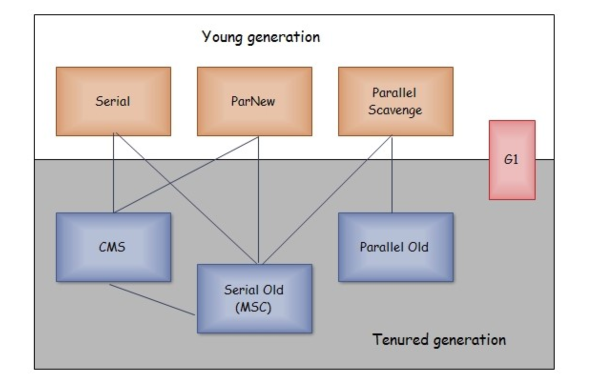

5.1 Serial收集器
- 定义:一个单线程的垃圾收集器，在垃圾收集时必须暂停其他所有工作线程，直到收集结束。
- 对于新生代采取复制算法暂停所有线程，对于老年代使用标记-整理算法同样暂停所有线程。
- 缺点：需要暂停用户线程。
- 优点：
  1. 简单高效、对于内存资源受限的环境，它是所有收集器里额外内存消耗最小的。
  2. 单核处理器或者处理器核心较少的环境来说，Serial由于没有线程交互的开销，可以专心做垃圾回收自然可以获得最高的单线程收集效率。

5.2 Serial Old收集器
- 定义：使用标记-整理算法。
- 用途：可以Parallel Scavenge收集器搭配使用，另一种是作为CMS收集器发生失败的后背方案。
  
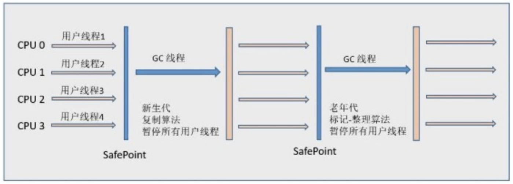

5.4 ParNew收集器
- 定义：Serial收集器的多线程并行版本。
- 唯一的优点仅有ParNew和Serial可以和CMS收集器配合工作，以后ParNew将会合并入CMS，成为其处理新生代的组成部分。
- 随着可以被使用的处理核心增加，ParNew对于垃圾收集时系统可以高效利用，默认开启的收集线程数和处理器核心数量相同。
- 新生代：标记复制。老年代：标记-整理
- 常使用参数：-XX:SurvivorRatio、-XX:PretenureSizeThreshold、-XX:HandlePromotionFailure

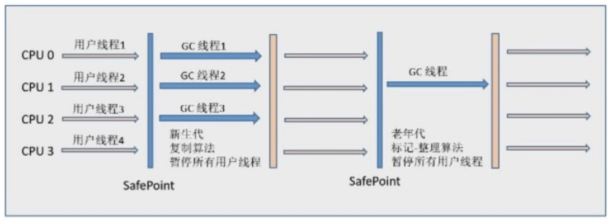

5.5 Parallel Scavenge 收集器
- 定义：新生代收集器，同样基于标记-复制算法，能够并行收集的多线程收集器。特点是达到一个可控制的吞吐量。
- 吞吐量= 运行客户代码时间/(运行用户代码时间+运行垃圾收集时间)
  - 虚拟机完成用户任务及垃圾收集用了100分钟，其中垃圾收集用了1分钟，吞吐量=99%
  - -XX:MaxGCPauseMills：控制最大垃圾收集时间参数
    - 允许设置的是一个大于0的毫秒数，垃圾收集停顿时间缩短是以牺牲吞吐量和新生代空间为代价换区的。调小新生代会缩短垃圾回收时间，若调的太小会导致垃圾收集变得频繁。
  - -XX:GCTimeRatio：设置吞吐量大小时间
    - 设置的值应当是大于0小于100的整数，也就是垃圾回收时间占总时间的比率为吞吐量的倒数。
    - 设置成19，那允许垃圾回收时间为总时间的5%(1/(1+19))，默认值为99,允许最大1%的时间进行垃圾回收。
  - -XX:+UseAdaptiveSizePolicy: 开启自适应的调整策略。

5.6 Parallel Old收集器
- 定义：Parallel Scavenge收集器的老年版本，支持多线程并发收集，基于标记-整理算法。
- 与Parallel Scavenge搭配作为“吞吐量优先”的收集器搭配组合

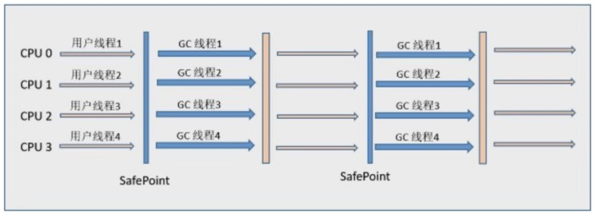

5.7 CMS(Concurrent Mark Sweep)收集器
- 定义：一种以获取最短回收停顿时间为目标的收集器，工作于老年代。
- 运行过程解析：基于标记-清除算法实现，具体步骤如下，
  - 初始标记：仅仅标记一下GC Root对象能直接关联到的对象，速度很快，需要暂停所有线程。
  - 并发标记：从GC Root关联对象开始遍历整个对象图的过程，可以与用户线程共同执行。
  - 重新标记：因用户程序继续运行而导致标记产生变动的那部分对象的标记记录，通常比初始标记长远比并发标记段。
  - 并发清除：清理删除掉标记阶段判断的已经死亡的对象，由于不需要移动对象，因此可以与用户线程共同执行。
- 特点：
  - 1.对处理器资源非常敏感。CMS默认启动的回收线程数是(处理器数量+3)/4，因此弱核心数量在4个以上，占用内存不超过25%。若核心数量小于4，则占用内存过大。
  - 2.无法处理“浮动垃圾”，有可能出现并发模式失败进而导致一次Full GC。浮动垃圾为出现在标记过程结束之后产生的对象。因为CMS要支持手机过程中与用户线程并存，因此不能在老年代几乎被填满时再运行，需要预留一部分空间供并发收集的程序运行。
    - JDK5中设置CMS在老年代使用了68%便会激活，JDK6默认的设置提高到92%。当运行预留的内存无法满足程序分配新对象的需要，就会出现一次“并发失败”。后备预案为冻结用户线程，启用Serial Old进行老年代的垃圾收集。
    - -XX:CMSInitiatingOccupancyFraction 可以设置触发CMS收集的百分比。
  - 参数-XX:CMSFullGCsBeforeCompaction：作用是要求CMS收集器在执行过若干次不整理的Full GC之后，下一次先进行碎片整理(默认值为0，表示每次FullGC都进行碎片整理) 

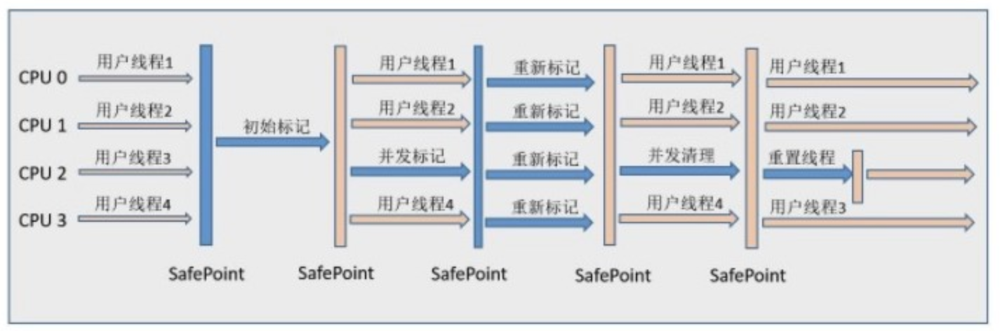

5.8 Garbage First 收集器
- 定义：面向服务端应用的垃圾收集器，基于Region的堆内存布局进行垃圾收集，每一个Region都可以根据需要扮演新生代的Eden空间、Survivor空间和老年代空间。Region中海油一类特殊的Humongous区域，专门用来存储大对象，G1认为只要超过了一个Region一半的对象即可认为是大对象。对于Humongous区域，正常当做老年代一部分。
- 参数Region的大小可通过-XX:G1HeapRegionSize设定，取值范围为1M~32M，为2的N次幂。
- 用户设定的允许收集停顿时间使用参数-XX:MaxGCPauseMills指定，默认为200毫秒。调的调小会导致每次的回收集只占内存的很小一部分，收集的速度慢于分配的速度导致垃圾堆积，进而引发Full GC。正常设置为100~300毫秒之间。
- 运行步骤：
  1. 初始标记：标记GC Root对象能直接关联的对象并修改TAMS指针的值为正确的空区域。需要暂停线程，但是时间很短，借用进行Minor GC时同步完成。
  2. 并发标记：根据GC Root进行可达性分析，扫描对象图。完成扫描后，处理SATB记录下并发时有引用变动的对象。
  3. 最终标记：短暂暂停用户线程，处理并发阶段结束后，少量的SATB记录。
  4. 筛选回收：更新Region的统计数据，进行回收价值和成本的排序，根据用户期望的停顿时间来构建回收集合。回收集合的存活对象复制到空的Region，再清理旧的Region。涉及到对象移动，需要暂停用户线程，使用多线程并行完成移动。
- G1整体是基于标记-整理算法实现的收集器，但从局部优势基于标记-复制算法实现。
- 特点:
  1. 避免在整个Java堆进行全区域的垃圾回收，而是让G1跟踪每个Region的垃圾回收的价值及回收所需的时间，在后台维护一个优先级表。根据用户设定的允许收集停顿时间，优先回收价值收益最大的Region。(使用参数-XX:MaxGCPauseMills指定)
  2. G1收集器每个Region都需要自己的记忆集，记录跨区域引用，因此比其他收集器要耗费内存，大约为java堆内存容量10%~20%。
  3. 通过在Region中划分空间(使用两TAMS指针，标记一块区域)用于并发回收的新对象分配，解决并发标记阶段与用户线程互不干扰。同样若内存分配速度大于内存回收速度，也许冻结用户线程Full GC。
  4. CMS使用增量更新算法，而G1使用原始快照(SATB)算法来解决，用户线程改变对象的引用关系，不打破原有的对象图结构，防止标记错误。
  5. 可靠停顿预测模型的建立：根据每个Region的回收成本，分析出收集的平均值、标准偏差、置信度等统计信息。
- 缺点：内存占用过高，在小内存应用上CMS的表现大于G1。
  
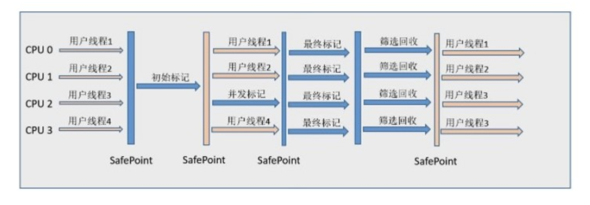
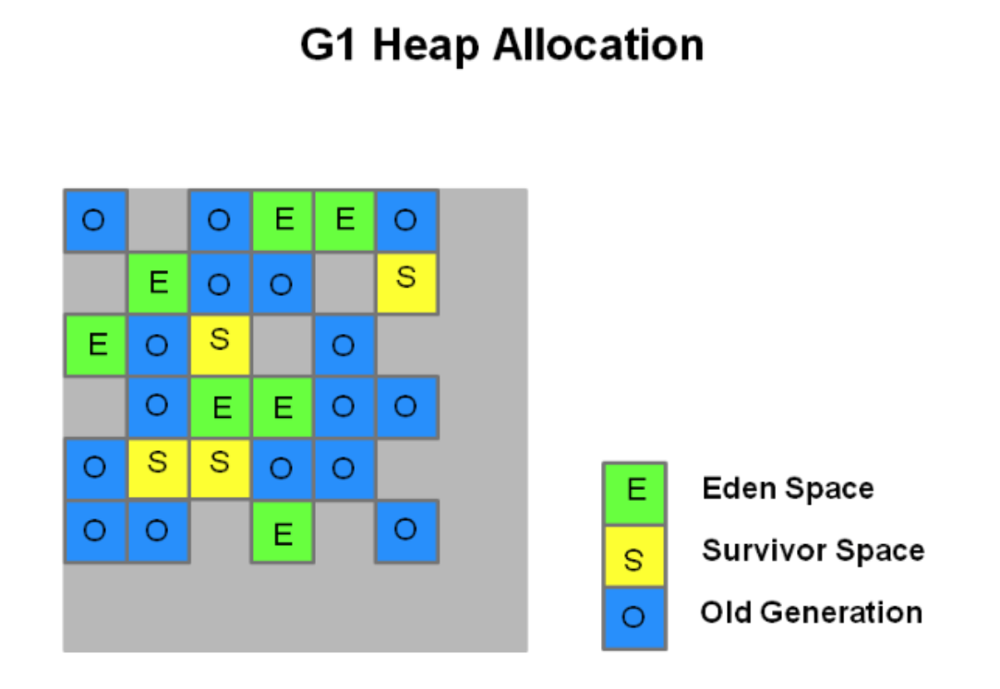

5.9 其他的垃圾收集器
- Shenandoah 收集器：仅存在OpenJdk，区别G1的特点为支持并发整理，使用转发指针和读屏障实现。
- ZGC 收集器：Region具有动态性，并分为大中小三个Region，使用染色指针技术实现并发整理算法。
- Epsilon收集器：无操作收集器。

5.10 选用收集器的三个因素
1. 如果是数据分析、科学计算类任务，目标是尽快可以算出结果，那么吞吐量为主要关注点。如果为SLA应用，停顿时间直接影响任务质量，严重甚至会导致事务超时，那么延迟是主要的关注点。
2. 使用运行的基础设施的指标。
3. JDK对应的版本。

## 十二、Java 内存模型

#### 12.1. 硬件的效率与一致性
- 现代的计算机系统都不得不加入一层或多层读写速度尽可能接近处理器运算速度的高速缓存来作为内存与处理器之间的缓冲。
  - 这就引入了缓存一致性的问题，每个处理器有自己的高速缓存而他们又共享同一主内存。
  - 为了使出使处理器内部的运算单位尽量被充分利用，处理器会对输入代码进行乱序执行优化。
  
#### 12.2. java内存模型
- 目的：java内存模型是关注在虚拟机中把变量值存储到内存和从内存取出变量这样的底层细节。此处的变量包括了实例字段、静态字段和构成数组对象的元素，但是不包括局部变量和方法参数。
  - 如果局部变量是一个reference类型，引用的对象在java堆中，但是reference本身在java栈的局部变量表中是线程私有。
- java内存模型规定了所有变量都存储在主内存，每条线程还有自己的工作内存，线程的工作内存保存了被该线程使用的变量的主内存副本。线程对变量的所有操作都必须在工作内存中进行，而不能直接读写主内存的数据。不同线程的内存数据无法直接访问，均得通过主内存。
  - 关于线程内存的复制，如果主内存有一个10MB的对象，线程会把对这个对象的引用、对象中在线程中的字段进行复制，但不会整个复制。
- 如果要把java的内存强行与Java内存区域做对应的话：
  - 主内存 -> java 堆
  - 工作内存 -> 虚拟机栈
  - 从更基础层次上，主内存直接对应物理硬件的内存。

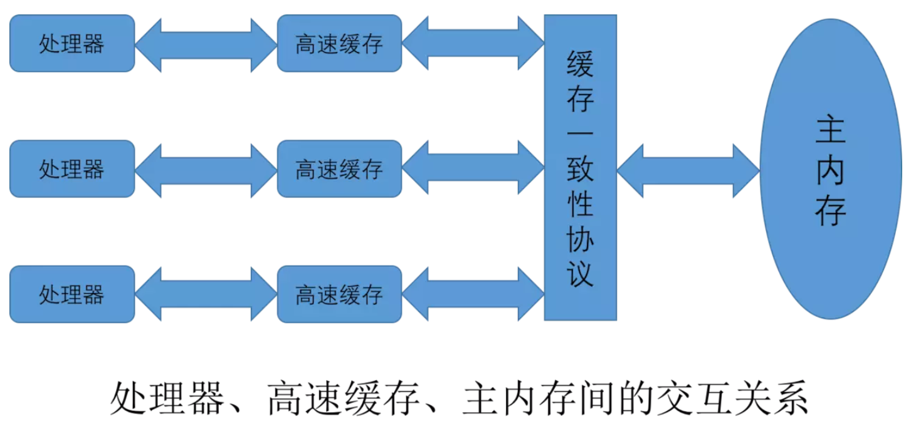

#### 12.3. 内存交互的操作
- 相关动作
  - lock、unlock：作用于主内存的变量，标识线程独占
  - read：作用于主内存，把变量值从主内存传输到工作内存，便于load使用。
  - load：作用于工作内存，把read操作得到的变量值放入工作内存。
  - use：作用工作内存，把工作内存传给执行引擎。
  - assign：作用工作内存，把执行引擎的值赋给工作内存。
  - store：作用于工作内存，把工作内存变量传送到主内存。
  - write：作用于主内存，把store操作获取的值放到主内存。
- 规则：
  - read、load   store、write搭配使用。
  - 不允许线程丢弃最近的assign，也不能没有发生assign就同步工作内存数据到主内存。
  - 一个变量执行lock操作会清除工作内存中该变量的值，需从主内存重新同步。
  - 一个变量执行unlock操作必须先同步回主内存。
 
#### 12.4 volatile变量特殊规则
- 性能：volatile变量的读操作性能与普通变量几乎没有差别，但是写操作可能会慢些，因为需要插入内存屏障指令来保证处理器不乱序执行。
- 保证变量可见性：
  - 定义：当一条线程修改了这个变量的值，新值对于其他线程是立即可见的。
  - volatile并发下是安全的？不，只能保证取值的时候是线程安全，当获取值之后做操作如果不是原子操作，很可能变量已经被其他线程改变。如多线程对volatile变量符号运算。
  - 正常的变量修改的过程中，工作内存与主内存同步是存在延迟的，也就出现了可见性的问题。
- 禁止指令重排序优化：
  - 定义：普通的变量只能保证代码执行完成获取的结果一致，而不能保证执行顺序与代码顺序一致。
  - 例子：如下双重加锁的例子，volatile保证了变量初始化完立即刷新到主内存中，能让其他线程可以获取到。
    - 而防止指令重排uniqueInstance = new Singleton(); 这段代码其实是分为三步执行：
    -  singleton = new Singleton()实际上分为： （1）为uniqueInstance 分配内存空间（2）初始化 uniqueInstance（3）将 uniqueInstance 指向分配的内存地址
    - 但是由于 JVM 具有指令重排的特性，执行顺序有可能变成 1>3>2。指令重排在单线程环境下不会出现问题，但是在多线程环境下会导致一个线程获得还没有初始化的实例。例如，线程 T1 执行了 1 和 3，此时 T2 调用 getUniqueInstance() 后发现 uniqueInstance 不为空，因此返回 uniqueInstance，但此时 uniqueInstance 还未被初始化。
```
public class Singleton{
    private Singleton() {}
    private static volatile Singleton singleton = null;
    public static Singleton getSingleton() {
        if(singleton == null) {
            synchronized(Singleton.class){
                if(singleton ==null) {
                    singleton = new Singleton();
                }
            }
        }
        return singleton;
    }
}
```

#### 12.5 先行发生原则
- 程序次序规则：线程按照控制流顺序执行，控制流顺序不是代码顺序，因为要考虑分支和循环。
- 管道锁定规则：一个unlock操作先行发生后面对同一个锁的lock操作。时间上先后执行。
- volatile规则：对一个变量的写操作先行发生于读动作。
- 线程启动规则：线程对象start()方法先行发生。
- 线程终止规则：线程中所有操作先行发生于对此线程的终止检测。Thread::isAlive()
- 线程中断规则：对线程的interrupt()方法的调用先行发生于中断检测。
- 对象终结规则：对象初始化完成先行发生于finalize()方法。
- 传递性: A->B, B->C  => A->C

例子：见代码，两线程操作一个变量。

#### 12.6 Java 与线程
- 线程的关键方法都被声明为Native

- 内核线程(KLT)；可以视为内核的一个分身。
- 轻量级进程(LWP)：每个都由内核线程支持，1:1。系统调用需要在用户态和内核态切换，代价高。
- 用户线程：完全建立在用户控件的线程库，优势不需要内核支持，劣势没有内核支援，需要自己定义线程操作。
- 混合实现：轻量级进程上支持多个用户线程。

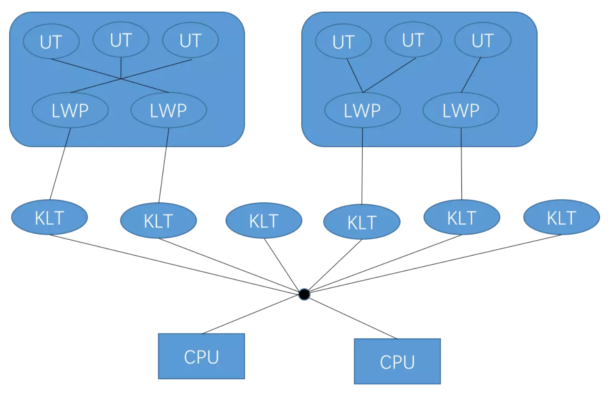

- java线程调度
  - 抢占式调度。
  - 使用线程优先级不是稳定的调节手段，如Java优先级10个，而在window上运行为6个优先级。
  
## 十三、线程安全与锁安全
- 定义：多个线程同时访问一个对象时，如果不用考虑这些线程在运行时环境的调度和交替执行，也不需要进行额外的同步，或者在调用方进行任何其他的协调操作，调用这个线程的行为都可以获得正确的结果，则这个对象是线程安全的。
#### 13.1 java中的线程安全
- 不可变：声明为final，没有发生this引用逃逸(this逃逸就是说在构造函数返回之前其他线程就持有该对象的引用，调用尚未构造完全的对象的方法可能引发错误。)
- String对象时不可变的，针对其操作均会返回一个新构造的字符串对象。
- 绝对线程安全：不管运行时环境如何，调用者都不需要任何额外的同步措施。
    - Vector线程安全容器，当一个线程移除元素，另一个线程获得元素时，会发生越界异常，不是绝对线程安全。
- 相对线程安全：通常意义的线程安全，单次操作是线程安全。
- 线程兼容：对象本身不是线程安全，但是调用时可以通过措施变成线程安全，如使用synchronize。
- 线程对立：基本废弃。

#### 13.2 线程安全实现(虚拟机)
- 互斥同步：并发访问时，临界区、互斥量和信号量都是常见的互斥实现方式。
- Java的线程是直接映射到操作系统的原生内核线程之上的，因此阻塞或唤醒就不可避免的陷入用户态到核心态的转换中。
- ReentrantLock与synchronize的区别在于多了下面几个功能：
  - 等待可中断：等待锁的线程可选择放弃等待
  - 公平锁：按申请锁的时间顺序获得，通过构造函数的变量实现，会明显影响吞吐量。
  - 锁绑定多个条件：ReentrantLock可绑定多个Condition对象。
  
- 非阻塞同步：
  - 乐观锁：基于冲突检测的乐观并发策略。CAS，会有ABA问题。

#### 13.3 锁优化
- 自旋锁和自适应锁
  - 自旋锁：对于锁状态很短的线程，挂起和恢复线程是开销很大的，因此让线程执行一个忙等待（自旋），这就是自旋锁的技术
  - 自适应锁：自适应意味着自旋的时间不固定，由前一次在同一个锁上的自旋时间及锁的状态拥有者来决定。（如果之前自旋获得过锁，进而允许本次自旋更长时间。若很少成果获得锁，那么可能直接忽略跳过等待）
- 锁消除：执行的方法体所有数据都不会逃逸出去被其他线程访问到，认为是线程私有的，便可以消除锁。
- 锁粗化：同步块过于细化，导致多次获取锁，导致不必要的性能损耗，扩大锁的范围便可以解决这个问题。
-